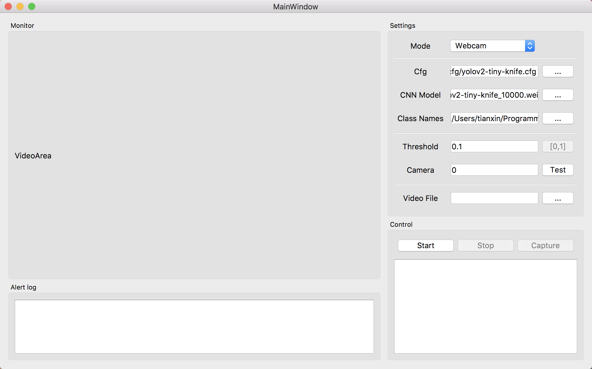

# 使用QT编写的一个yolo小程序

## Requirements

- OpenCV 3.4
- Qt 5.10

## 运行截图

## 其他

另附一个自己做的识别刀的数据集和模型，因为各种各样的刀太多了，所以在现实中识别效果一般。下载地址：
链接:https://pan.baidu.com/s/1qV4v5ST-hz5SU2w8VBpHNA  密码:gz1i

另外标注工具我使用的是[BBox-Label-Tool](https://github.com/puzzledqs/BBox-Label-Tool)，上面的网盘里面也有，里面加了一个转换BBox标签到darknet标签的脚本`convert.py`。

参考标注和训练教程：https://timebutt.github.io/static/how-to-train-yolov2-to-detect-custom-objects/